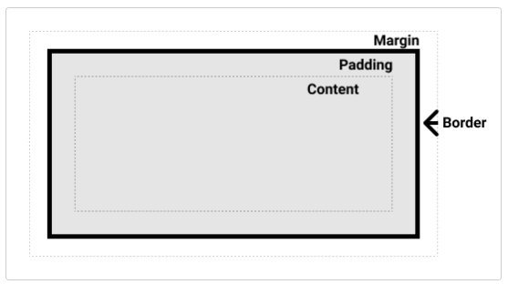

## Box Model CSS
------------------------------------------------

Cada cosa en una webpage es una caja rectangular (box).

* Display type (tipo de visualización)
    * Outer (externo)
    * Inner (interno)

Estos tipos de visualizaciones se configuran a partir de la propiedad `display ` de css.

>**PREGUNTA**: Cómo sé cuándo tengo que aplicar un *outer display type* o un *inner display type*? Es algo que se aplica?

Elementos como `<h1>` o `
` usan por defecto un  `display: block`

**display: inline-flex;** 
muestra el elemento sin ocupar todo el ancho de la linea. se ajusta a su tamaño.

**display: inline-block;**
sería como un termino intermedio entre inline y block. Puede usarse, ejemplo, para darle al usuario un area de clickeo más grande en un link.

**display: block;**
ocupa todo el ancho disponible de la linea.

Un span ocupa lo que la extensión de su contenido ordena. Por definición es la cantidad de espacio que algo cubre. Es decir, el elemento span ocupará el espacio que ocupe su contenido.

**display: flex;** 
Hace que el elemento se adapte (sea flexible) a los cambios que ocurran en su contenido. Por ende, el espacio que ocupará se irá ajustando de acuerdo a su contenido. 

>**PREGUNTA**: La característica de no ocupar toda la linea y ajustarse al tamaño del contenido, es gracias al flex o al inline?

#### Partes de una box

El content es aquello que se encuentra dentro del elemento. Puede modificarse con las siguientes propiedades:
* `inline-size`
* `block-size`
* `width`
* `height`

El padding es el "relleno" que envuelve al content. Se utiliza para alejar al content del border. A diferencia del margin, *no puede* tener valores negativos. Puede modificarse con las siguientes propiedades:
* `padding` y todas las propiedades relacionadas (`padding-algo`)

El border es la caja que envuelve al padding y al content.  Puede modificarse con las siguientes propiedades:
* `border` y todas las propiedades relacionadas (`border-algo`):
    * `border-right`
    * `border-top`
    * `border-bottom`
    * `border-left`
    * `border-width`
    * `border-style`
    * `border-color`

El margin es la más externa de las capas de la box. Lo que hace es separar la box de otras boxes. Su valor puede ser negativo. Puede modificarse con las siguientes propiedades:
* `margin` y todas las propiedades relacionadas (`margin-algo`):
    * `margin-top`
    * `margin-left`
    * `margin-right`
    * `margin-bottom`

Otra propiedad del margin es `auto`, la cual básicamente le dice al navegador que defina el margin por vos. En la mayoría de los casos, el valor de `auto` será 0; o sino será cualquiera sea el espacio que haya disponible en ese lado del elemento.
`auto` es útil para el centrado *horizontal*. Para esto, es necesario que el elemento tenga seteado un `width`.   

Si tenemos dos elementos cuyos márgenes se tocan, los resultados visibles serán diferentes dependiendo de los valores de cada margen:

1. Si los dos márgenes son positivos, se toma el que tiene mayor valor. Y ambos margenes su fusionan y predomina el de mayor valor.
2. Si los dos márgenes son negativos, ambos colapsan y se toma el de menor valor (en este caso, el de mayor distancia al cero, el más negativo digamos).
3. Si uno de los márgenes es positivo y el otro es negativo, el margen resultante será el de la resta entre ambos.

En el modelo de cajas estándar, el tamaño de la caja está determinado por la suma del tamaño de: la caja de contenido + la caja del padding + la caja del border. 
El margin no se toma en cuenta dado que apunta hacia afuera de la caja.

En el modelo de cajas alternativo, el tamaño de la caja está determinado por el tamaño de la caja de contenido. No se toman en cuenta las otras cajas (padding y border).

